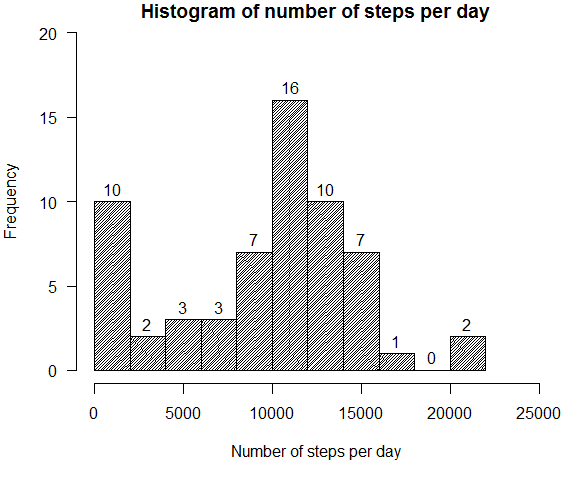
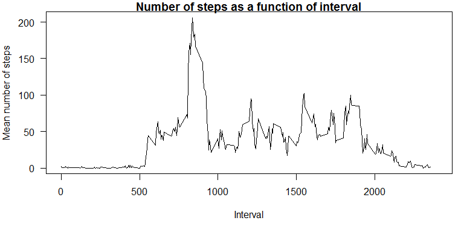
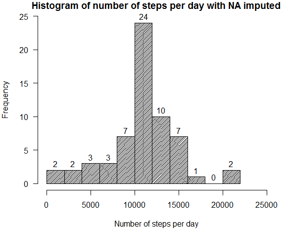
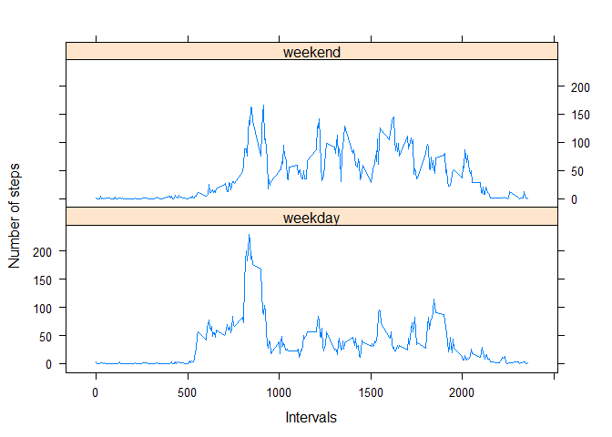

# Reproducible Research: Peer Assessment 1


## Loading and preprocessing the data

Preparing the environment for futher R Markdown file processing:

```r
require(knitr)
```

```
## Loading required package: knitr
```

```
## Warning: package 'knitr' was built under R version 3.1.3
```

```r
opts_chunk$set(echo = TRUE, cache = TRUE, cache.path = "cache/", fig.path = "figure/")
```

First, load necessary packages

```r
library(data.table)
```

```
## Warning: package 'data.table' was built under R version 3.1.3
```

```r
library(reshape2)
```

```
## Warning: package 'reshape2' was built under R version 3.1.3
```

```r
library(plyr)
library(lattice)
```

Read the data into data frame

```r
df <- read.csv('activity.csv')
```


## What is mean total number of steps taken per day?

Calculate the total number of steps taken per day

```r
#nsday <- aggregate(df, by=list(df$date), FUN=length, na.rm=TRUE)
nsday <- ddply(df, "date", summarise,
               N.steps = sum(steps, na.rm=TRUE) 
               )
#               mean = mean(steps, na.rm=TRUE),
#               sd   = sd(steps, na.rm=TRUE),
#               se   = sd / sqrt(N)
print(head(nsday,5))
```

```
##         date N.steps
## 1 2012-10-01       0
## 2 2012-10-02     126
## 3 2012-10-03   11352
## 4 2012-10-04   12116
## 5 2012-10-05   13294
```

```r
print(tail(nsday,5))
```

```
##          date N.steps
## 57 2012-11-26   11162
## 58 2012-11-27   13646
## 59 2012-11-28   10183
## 60 2012-11-29    7047
## 61 2012-11-30       0
```

If you do not understand the difference between a histogram and a barplot, research the difference between them. Make a histogram of the total number of steps taken each day

```r
par(mar = c(5, 4, 1, 1), las = 1)
hist(nsday$N.steps,
     breaks = 10,
     density = 50,
     angle = 45,
     main = "Histogram of number of steps per day",
     xlim = c(0, 25000),
     ylim = c(0, 20),
     xlab = "Number of steps per day",
     labels = TRUE
     )
```

 

Calculate and report the mean and median of the total number of steps taken per day

```r
nsday.mean <- mean(nsday$N.steps)
nsday.median <- median(nsday$N.steps)
```

The **mean** of the total number of steps taken per day is **9354**

The **median** of the total number of steps taken per day is **10395**


## What is the average daily activity pattern?

Make a time series plot (i.e. type = "l") of the 5-minute interval (x-axis) and the average number of steps taken, averaged across all days (y-axis)

First, compute the average number of steps taken at each 5-min interval

```r
nsint <- ddply(df, "interval", summarise,
               N.steps = mean(steps, na.rm = TRUE)
               )
print(head(nsint,5))
```

```
##   interval   N.steps
## 1        0 1.7169811
## 2        5 0.3396226
## 3       10 0.1320755
## 4       15 0.1509434
## 5       20 0.0754717
```

```r
print(tail(nsint,5))
```

```
##     interval   N.steps
## 284     2335 4.6981132
## 285     2340 3.3018868
## 286     2345 0.6415094
## 287     2350 0.2264151
## 288     2355 1.0754717
```

Plot the average number of steps taken against all intervals

```r
par(mar = c(5, 4, 1, 1), las = 1)
plot(nsint$interval, nsint$N.steps,
     type = "l",
     main = "Number of steps as a function of interval",
     xlim = c(0, 2400),
     xlab = "Interval",
     ylab = "Mean number of steps"
     )
```

 

Which 5-minute interval, on average across all the days in the dataset, contains the maximum number of steps?

```r
stepmax <- max(nsint$N.steps)
imax <- nsint$N.steps==stepmax
intmax <- nsint$interval[imax]
```

The **835th** interval contains the maximum number of steps (**206**)

## Imputing missing values

Calculate and report the total number of missing values in the dataset (i.e. the total number of rows with NAs)

```r
N.NAs.s <- sum(as.numeric(is.na(df$steps)))
N.NAs.i <- sum(as.numeric(is.na(df$interval)))
N.NAs.d <- sum(as.numeric(is.na(df$date)))
print(c(N.NAs.s, N.NAs.i, N.NAs.d))
```

```
## [1] 2304    0    0
```

The total number of missing values in the dataset is **2304** that comprise **8** days

Devise a strategy for filling in all of the missing values in the dataset. The strategy does not need to be sophisticated. For example, you could use the mean/median for that day, or the mean for that 5-minute interval, etc.

Create a new dataset that is equal to the original dataset but with the missing data filled in.

```r
df.mod <- df
nsint.long <- rep(nsint$N.steps, 61)
df.mod$steps[is.na(df$steps)] <- nsint.long[is.na(df$steps)]
print(summary(df.mod))
```

```
##      steps                date          interval     
##  Min.   :  0.00   2012-10-01:  288   Min.   :   0.0  
##  1st Qu.:  0.00   2012-10-02:  288   1st Qu.: 588.8  
##  Median :  0.00   2012-10-03:  288   Median :1177.5  
##  Mean   : 37.38   2012-10-04:  288   Mean   :1177.5  
##  3rd Qu.: 27.00   2012-10-05:  288   3rd Qu.:1766.2  
##  Max.   :806.00   2012-10-06:  288   Max.   :2355.0  
##                   (Other)   :15840
```

```r
print(summary(df))
```

```
##      steps                date          interval     
##  Min.   :  0.00   2012-10-01:  288   Min.   :   0.0  
##  1st Qu.:  0.00   2012-10-02:  288   1st Qu.: 588.8  
##  Median :  0.00   2012-10-03:  288   Median :1177.5  
##  Mean   : 37.38   2012-10-04:  288   Mean   :1177.5  
##  3rd Qu.: 12.00   2012-10-05:  288   3rd Qu.:1766.2  
##  Max.   :806.00   2012-10-06:  288   Max.   :2355.0  
##  NA's   :2304     (Other)   :15840
```

Make a histogram of the total number of steps taken each day and calculate and report the mean and median total number of steps taken per day. Do these values differ from the estimates from the first part of the assignment? What is the impact of imputing missing data on the estimates of the total daily number of steps?

Calculate the total number of steps taken per day

```r
nsday.mod <- ddply(df.mod, "date", summarise,
               N.steps = sum(steps, na.rm=TRUE) 
               )
print(head(nsday.mod,5))
```

```
##         date  N.steps
## 1 2012-10-01 10766.19
## 2 2012-10-02   126.00
## 3 2012-10-03 11352.00
## 4 2012-10-04 12116.00
## 5 2012-10-05 13294.00
```

```r
print(tail(nsday.mod,5))
```

```
##          date  N.steps
## 57 2012-11-26 11162.00
## 58 2012-11-27 13646.00
## 59 2012-11-28 10183.00
## 60 2012-11-29  7047.00
## 61 2012-11-30 10766.19
```

Make a histogram of the total number of steps taken each day

```r
par(mar = c(5, 4, 1, 1), las = 1)
hist(nsday.mod$N.steps,
     breaks = 10,
     density = 50,
     angle = 45,
     main = "Histogram of number of steps per day with NA imputed",
     xlim = c(0, 25000),
     ylim = c(0, 25),
     xlab = "Number of steps per day",
     labels = TRUE
     )
```

 

Calculate and report the mean and median of the total number of steps taken per day

```r
nsday.mea <- mean(nsday.mod$N.steps)
nsday.med <- median(nsday.mod$N.steps)
print(round(nsday.mea))
```

```
## [1] 10766
```

```r
print(round(nsday.med))
```

```
## [1] 10766
```

The **mean** of the total number of steps taken per day is **1.0766\times 10^{4}**

The **median** of the total number of steps taken per day is **1.0766\times 10^{4}**


## Are there differences in activity patterns between weekdays and weekends?

Create a new factor variable in the dataset with two levels - "weekday" and "weekend" indicating whether a given date is a weekday or weekend day.

```r
weekday7 <- weekdays(as.Date(df.mod$date))
weekday2 <- rep("weekday", 17568)
weekday2[weekday7 == "Saturday" | weekday7 == "Sunday"] <- "weekend"
#weekday2 <- rep("weekend", 17568)
#weekday2[weekday7 != "Saturday" | weekday7 != "Sunday"] <- "weekday"
df.mod$weekday <- weekday2
df.mod$stepswkd <- rep(NaN, 17568)
df.mod$stepswkd[df.mod$weekday=="weekday"] <- df.mod$steps[df.mod$weekday=="weekday"]
df.mod$stepswnd <- rep(NaN, 17568)
df.mod$stepswnd[df.mod$weekday=="weekend"] <- df.mod$steps[df.mod$weekday=="weekend"]
```

Compute the average number of steps taken at each 5-min interval during weekdays and weekends

```r
nsintwd <- ddply(df.mod, "interval", summarise,
                 weekday = mean(stepswkd, na.rm=TRUE),
                 weekend = mean(stepswnd, na.rm=TRUE)
                 )
print(head(nsintwd,5))
```

```
##   interval    weekday     weekend
## 1        0 2.25115304 0.214622642
## 2        5 0.44528302 0.042452830
## 3       10 0.17316562 0.016509434
## 4       15 0.19790356 0.018867925
## 5       20 0.09895178 0.009433962
```

```r
print(tail(nsintwd,5))
```

```
##     interval   weekday     weekend
## 284     2335 2.2486373 11.58726415
## 285     2340 2.2402516  6.28773585
## 286     2345 0.2633124  1.70518868
## 287     2350 0.2968553  0.02830189
## 288     2355 1.4100629  0.13443396
```

Make a panel plot containing a time series plot (i.e. type = "l") of the 5-minute interval (x-axis) and the average number of steps taken, averaged across all weekday days or weekend days (y-axis).

```r
nsintwd.molten <- melt(nsintwd, id.vars=c("interval"))
xyplot(
      nsintwd.molten$value ~ nsintwd.molten$interval | 
      nsintwd.molten$variable, panel =           
      function(x, y, ...){panel.xyplot(x, y, ...)},
      type="l",
      xlab="Intervals",
      ylab="Number of steps",
      layout=c(1,2)
      )
```

 

